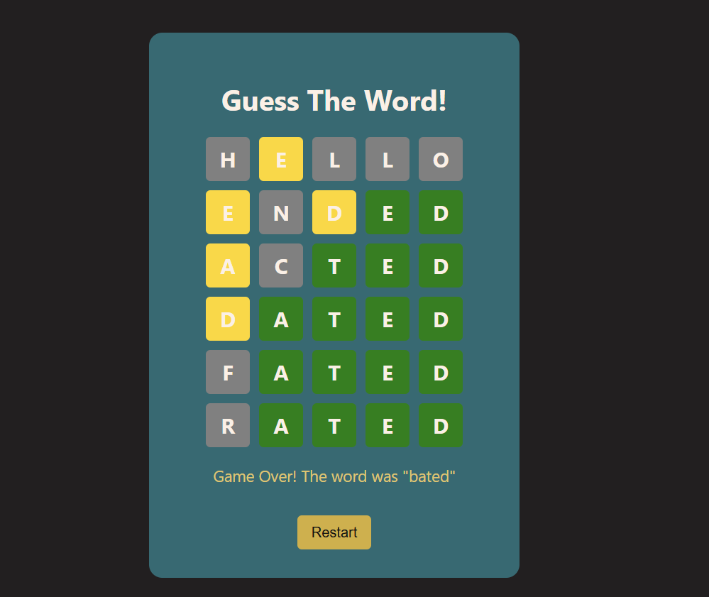

# 🔠 VocaBoom - WordGuess Challenge

A clean and fun 5-letter word guessing game built with **React** and powered by the **Datamuse API** for dynamic word generation.

Test your vocabulary, make 6 attempts, and get visual feedback on your guesses — just like Wordle!

---

##  Preview

  

---

##  Live Demo

Give it a try – see if you can guess the word! :  
[VocaBoom live app](https://voca-boom.vercel.app/)

---

##  Features

-  Random word fetched from the [Datamuse API](https://www.datamuse.com/api/)
-  Color-coded feedback (green: correct, gold: present, gray: absent)
-  Maximum 6 attempts per game
-  Restart option after game ends
-  Clean, minimal UI with soft color palette